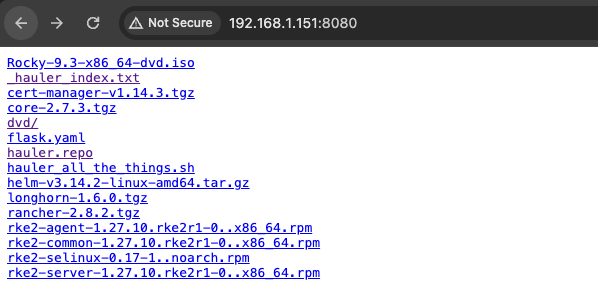

# Fun Hack - Host REPO server from Hauler

## Add iso to manifest

```yaml
mkdir /opt/hauler
cd /opt/hauler
cat << EOF > /opt/hauler/airgap_hauler.yaml
apiVersion: content.hauler.cattle.io/v1alpha1
kind: Files
metadata:
  name: rancher-files
spec:
  files:
    - path: https://github.com/rancher/rke2-packaging/releases/download/v1.27.10%2Brke2r1.stable.0/rke2-common-1.27.10.rke2r1-0..x86_64.rpm
    - path: https://github.com/rancher/rke2-packaging/releases/download/v1.27.10%2Brke2r1.stable.0/rke2-agent-1.27.10.rke2r1-0..x86_64.rpm
    - path: https://github.com/rancher/rke2-packaging/releases/download/v1.27.10%2Brke2r1.stable.0/rke2-server-1.27.10.rke2r1-0..x86_64.rpm
    - path: https://github.com/rancher/rke2-selinux/releases/download/v0.17.stable.1/rke2-selinux-0.17-1..noarch.rpm
    - path: https://get.helm.sh/helm-v3.14.2-linux-amd64.tar.gz
    - path: https://download.rockylinux.org/pub/rocky/9/isos/x86_64/Rocky-9.3-x86_64-dvd.iso
EOF
```

## Sync, and wait

```bash
cd /opt/hauler
# wait, the dvd is 10gb.
hauler store sync -f /opt/hauler/airgap_hauler.yaml
```

## Create systemd file and start, and wait

```bash
cat << EOF > /etc/systemd/system/hauler@.service
# /etc/systemd/system/hauler.service
[Unit]
Description=Hauler Serve %I Service

[Service]
Environment="HOME=/opt/hauler/"
ExecStart=/usr/local/bin/hauler store serve %i
WorkingDirectory=/opt/hauler

[Install]
WantedBy=multi-user.target
EOF

#reload daemon
systemctl daemon-reload

# start fileserver - this will take a few minutes to unpack the ISO
systemctl enable --now hauler@fileserver
```

## Mount ISO to `store-files` directory

```bash
# wait for hauler store-files
until [ -d /opt/hauler/store-files ]; do sleep 1; done ; cd /opt/hauler/store-files/

# make dir
mkdir -p /opt/hauler/store-files/dvd

# mount iso to the new dvd dir
mount -o loop Rocky-9.3-x86_64-dvd.iso /opt/hauler/store-files/dvd
```

## Yum repo all the things

Create repo files

```bash
serverIp=${server:-$(hostname -I | awk '{ print $1 }')}
cat << EOF > /opt/hauler/store-files/hauler.repo
[hauler]
name=Hauler Air Gap Server
baseurl=http://$serverIp:8080
enabled=1
gpgcheck=0
[rocky-dvd]
name=Rocky DVD
baseurl=http://$serverIp:8080/dvd/BaseOS/
enabled=1
gpgcheck=0
EOF
```

Everything should look like:



On downstreams add repo --> CHANGE IP/DNS!

```bash
yum-config-manager --add-repo http://$serverIP:8080/hauler.repo
yum clean all && yum repolist
```

## Bonus - Index

create an inventory of files, charts, and images. VERY helpful for troubleshooting.

```bash
hauler store info -s /opt/hauler/store > /opt/hauler/store-files/_hauler_index.txt
```

## Profit


